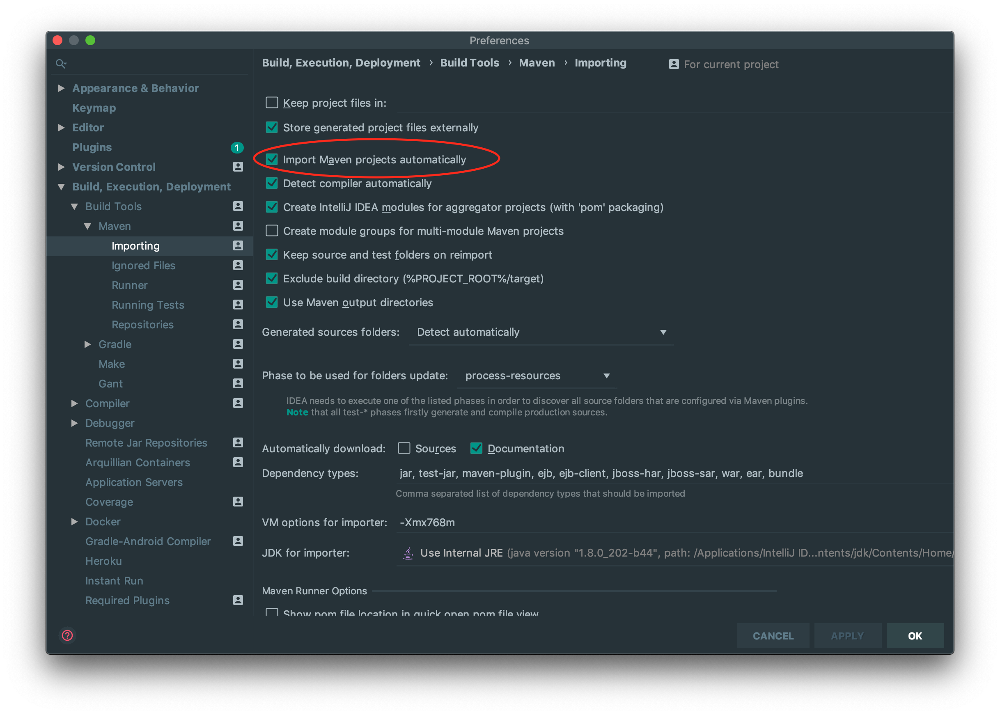
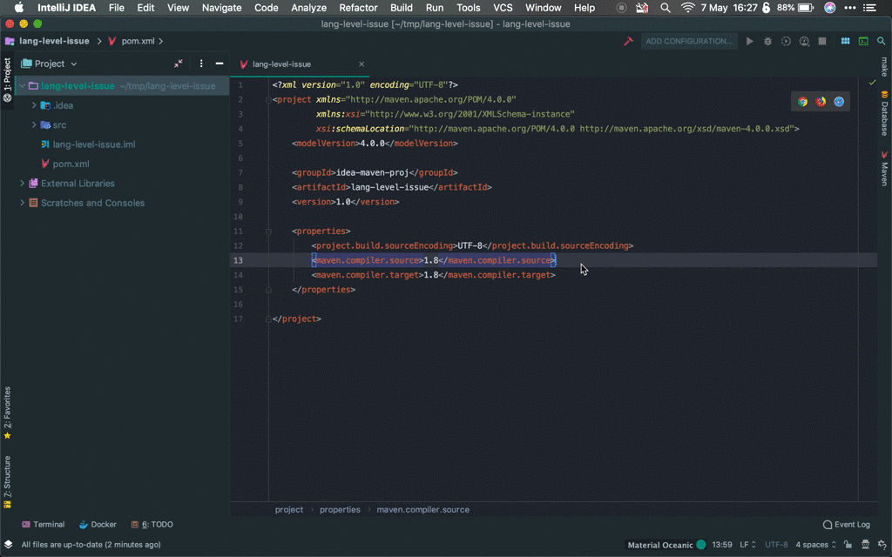

= Maven project language level issues on IntelliJ IDEA

A sample project to show that, when setting the Java version to be used by a Maven project
on IntelliJ IDEA 191.6707.61, if such version is defined
into the properties tag of the pom.xml, such as presented below,
IntelliJ ignores it and the project is set to use Java 5. 

```xml
    <properties>
        <project.build.sourceEncoding>UTF-8</project.build.sourceEncoding>
        <maven.compiler.source>1.8</maven.compiler.source>
        <maven.compiler.target>1.8</maven.compiler.target>
    </properties>
```

"Import maven projects automatically" is enabled.


The screencast below show that the project is still configured as Java 5.



The default Language Level defined either in "File >> Other Settings >> Preferences for New Projects"
and "File >> Other Settings >> Structure for New Projects" are only considered when creating regular projects.

== How to make it work

For maven projects, it only works when the `maven-compiler-plugin` is added directly, as below.

If you're using a JDK prior to 9, you can add the plugin as below
to define the Java version your project will be compiled to:

```xml
    <build>
        <plugins>
            <plugin>
                <groupId>org.apache.maven.plugins</groupId>
                <artifactId>maven-compiler-plugin</artifactId>
                <version>3.8.0</version>
                <configuration>
                    <source>1.8</source>
                    <target>1.8</target>
                </configuration>
            </plugin>
        </plugins>
    </build>
```

But if you're using JDK 9+, the configuration is different:

```xml
    <build>
        <plugins>
            <plugin>
                <groupId>org.apache.maven.plugins</groupId>
                <artifactId>maven-compiler-plugin</artifactId>
                <version>3.8.0</version>
                <configuration>
                    <release>8</release>
                </configuration>
            </plugin>
        </plugins>
    </build>
```

== Suggestion

Even if we can use the plugin to define the language level, using Java 5 as default when no configuration is set on the pom.xml file is really annoying. The default should be Java 8.
Some surveys such as the https://snyk.io/blog/jvm-ecosystem-report-2018/[JVM Ecosystem Report 2018 produced by Snyk] shows Java 8 has an adoption around 80%.

Using Java 5 as default is really annoying, mainly when you use IntelliJ IDEA to teach Java. This additional configuration is a barrier for some students.

This issue was reported in https://youtrack.jetbrains.com/issue/IDEA-212236[IDEA-212236].